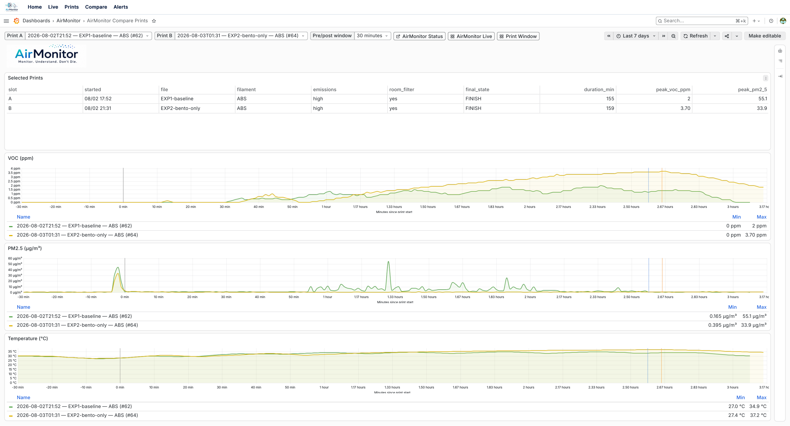
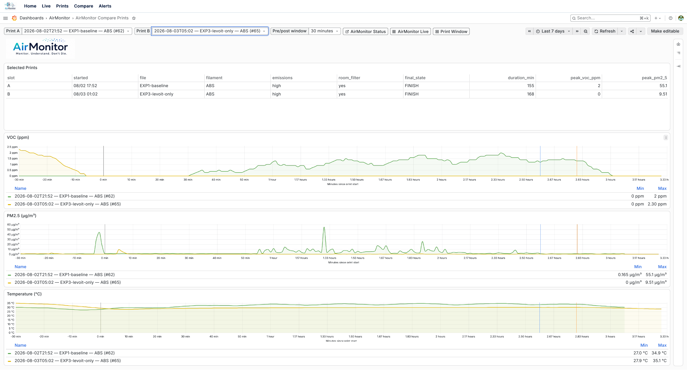
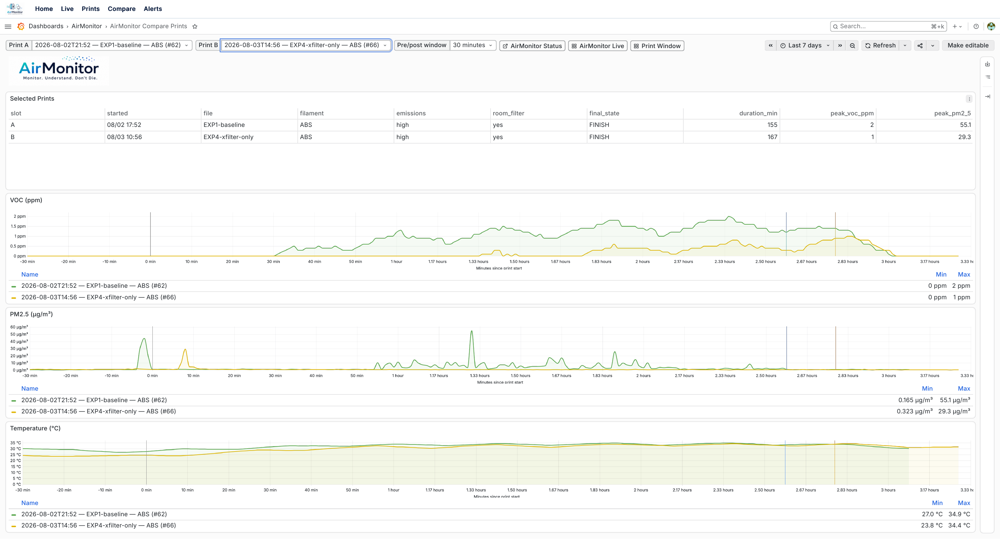
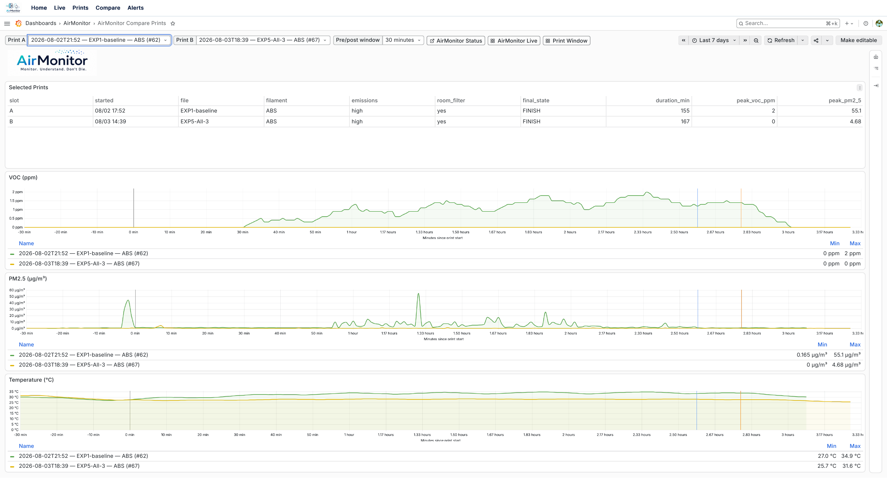

# Filter comparison: baseline vs. chamber filters vs. room filter (EXP1–EXP5)

**Printer:** Bambu X1-Carbon, same `.3mf` file and ABS spool (GFB99, `#76D9F4`) for every run.
**Sensor:** fixed position at the top of the enclosure, near the AMS filament feed-through — a
known, unsealed leak point on this printer, not the chamber's own exhaust port.
**Dashboard:** [AirMonitor Compare Prints](../../grafana/dashboards/airmonitor-compare-prints.json),
which overlays VOC (SGX sensor) and PM2.5 (SPS30 sensor) time series for two prints, aligned to
minutes-since-print-start.
**Room filter:** Levoit Core 400S, rated for 400 sq ft, used in a 255 sq ft room — meaningfully
oversized (~1.6x rated capacity) for this space.
**"No filter" (EXP1-baseline):** means *no filtration at all* — not just Bento/Levoit disabled.
The X1-Carbon's own built-in chamber filter cartridge was physically removed for this run, so
EXP1 represents the printer's raw, completely unfiltered emissions, not "stock filter only."
**Disclosure:** no affiliation with any sensor or filter manufacturer named in this write-up —
these are consumer products, purchased and tested independently.

| Run | Condition | VOC avg | VOC max | PM2.5 max | Duration |
|---|---|---|---|---|---|
| EXP1-baseline | No filtration (built-in chamber filter removed) | 0.81 ppm | 2.0 ppm | 55.1 µg/m³ | 155 min |
| EXP2-bento-only | [Voxel Bento Box](https://voxelpla.com/products/bento-box) (HEPA13+carbon), closed-loop recirculating, own fans | 1.58 ppm | 3.70 ppm | 33.9 µg/m³ | 159 min |
| EXP3-levoit-only | Standalone room HEPA+carbon (Levoit), fan speed 4 | ~0 ppm* | 2.30 ppm* | 9.51 µg/m³ | 168 min |
| EXP4-xfilter-only | [Voxel X-Filter](https://voxelpla.com/products/bambu-lab-x-filter) (HEPA13+carbon), drop-in replacement for the OEM chamber filter cartridge | 0.17 ppm | 1.0 ppm | 29.3 µg/m³ | 167 min |
| EXP5-All-3 | Bento + Levoit + X-Filter, all running simultaneously | 0.00 ppm | 0.0 ppm | 4.68 µg/m³ | 167 min |

*EXP3's VOC number needs a footnote — see below.

## EXP1 vs. EXP2: the chamber filter helps PM, and makes VOC worse

Bento (HEPA + activated carbon) sits *inside* the chamber itself, not externally ducted — it draws
chamber air through its own media and blows the cleaned air straight back out into the same
enclosed space, a closed-loop recirculating scrubber. It roughly **halves peak PM2.5** compared to
baseline — the huge, sustained ~50 µg/m³ trending into the print disappears down to isolated small
peaks. But VOC goes the *other* direction: baseline averaged 0.81 ppm, Bento averaged 1.58 ppm,
almost double.

This isn't a measurement error. It's a real, physically-grounded result, just not the mechanism it
might look like at first: Bento's fan keeps chamber air actively moving instead of letting it settle
into the calmer, natural-convection pattern the unfiltered baseline has. That constant circulation
sweeps air — including whatever fraction of VOC the carbon didn't capture on that pass — past the
sensor's own leak point at the top seam more often and with more force than passive convection alone
would. Particulates get knocked out efficiently on every pass through the HEPA stage regardless of
flow rate (inertial capture doesn't need a slow, careful pass to work), which is why PM still
improves. Gas-phase VOC doesn't get the same treatment — carbon adsorption only captures a fraction
per pass, and that fraction shrinks as flow rate rises, so a recirculating fan can increase the total
VOC that reaches the leak over the course of a print even while genuinely cleaning some of it each
cycle. Net effect: more internal air movement in a leaky enclosure works *for* PM containment
(near-total per-pass capture) and *against* VOC containment (partial, flow-sensitive capture), from
the very same fan.

## EXP1 vs. EXP3: the room filter doesn't touch the leak, and that's the point

Levoit is a standalone HEPA+carbon room purifier — it processes air *after* it's already escaped
into the room, completely independent of whatever is or isn't sealed on the printer's own
enclosure. It was switched on manually about 18 minutes before EXP3 started (verified via the
`airmonitor-levoit` service log: `Turning purifier ON ... Setting purifier fan speed: 4` at
2026-08-03 00:44:21 EDT); the VOC chart shows the tail of that decay — from ~2.3 ppm down to 0 —
completing right around print start, then holding flat at the sensor's resolution floor for the
entire 2h48m print. PM2.5 also improves over baseline, though less dramatically than Bento (a
standalone room unit further from the source has less throughput at the print itself).

Worth noting: this unit is rated for 400 sq ft and the room is only 255 sq ft, so it's delivering
meaningfully more air changes per hour here than its rating implies for a room this size. That
headroom is likely a real contributor to how completely it suppressed VOC — a 400S running at the
edge of its rated capacity in a larger room would plausibly show a smaller effect.

*Footnote on EXP3's VOC average: because the reading is genuinely pinned at the sensor's ~0.1 ppm
resolution floor for the whole print, "average" isn't a meaningful number the way it is for the
other two runs — there's no real signal above the floor to average. It isn't a sensor fault (the
sensor's temperature/humidity channels varied normally throughout on the same frames, and the SPS30
PM sensor kept reporting real data too) — it's the Levoit legitimately holding VOC below what this
setup can detect.

## EXP1 vs. EXP4: a filter in the actual exhaust path helps both, until it saturates

EXP4 uses a [Voxel X-Filter](https://voxelpla.com/products/bambu-lab-x-filter) (HEPA13+carbon) — a
drop-in replacement for the X1-Carbon's stock chamber filter cartridge, not a genuine Bambu OEM
filter (none was available to test), but occupying the same slot the OEM cartridge would: the
printer's own designed chamber-exhaust path, driven by the printer's own fan, not an independent
unit like Bento. The result looks different from both EXP2 and EXP3: VOC sat at a flat `0.0` for the
first **101 minutes** of the print (14:56:55 to roughly 16:38), then began a clean, sustained rise
at 16:43, climbing to the 0.3–0.4 ppm range within five minutes and continuing upward for the rest
of the print (peak 1.0 ppm by the end). That shape — full capture, then a real threshold, then a
rising climb — is a textbook activated-carbon breakthrough curve: the media adsorbs essentially
everything while it has spare capacity, then the front of the adsorption zone reaches the outlet and
effluent concentration starts climbing as the bed saturates.

Two things distinguish this from EXP2 (Bento): first, EXP4 gets an actual protected window before
breakthrough, because it sits in the chamber's one true exhaust path — air the printer actively
vents has to pass through this media on its way out. Bento is a separate, closed-loop recirculating
unit with its own fans: it draws chamber air through its own media and blows it straight back into
the same chamber, so it was never in a position to govern what leaves via the enclosure's own leak
in the first place — which is why EXP2's VOC curve climbed steadily from minute one with no flat
period at all, while EXP4 gets a genuine flat-zero window before its media saturates. Second, even
after breakthrough begins, EXP4 stays below EXP1-baseline for essentially the entire print (not just
the first 101 minutes) — breakthrough is a gradual saturation curve, not an on/off switch, so a
saturating filter still adsorbs a shrinking-but-real fraction rather than suddenly contributing
nothing. Net result: EXP4 roughly halves both peak VOC (2.0 → 1.0 ppm) and peak PM2.5 (55.1 → 29.3
µg/m³) versus true
baseline — a filter sitting in the chamber's actual exhaust path helps both metrics, for as long as
(and even somewhat after) it has capacity left.

## EXP1 vs. EXP5: stacking every mechanism closes every gap

EXP5 runs all three filters at once — Bento (in-chamber recirculating), X-Filter (in the chamber's
actual exhaust path), and Levoit (room-level) simultaneously. The result is about as complete as this
setup can measure: **every one of the 1,164 VOC samples across the full 167-minute print reads
exactly `0.0` ppm** — not "mostly flat with a few blips" like EXP4, genuinely zero variance the
entire print, matching EXP3's floor. PM2.5 peaked at **4.68 µg/m³**, better than any single-filter
condition, including Levoit alone (9.51 µg/m³).

This makes sense as three mechanisms covering three different pathways at once: X-Filter captures
a real fraction of whatever the printer actively exhausts before it can reach the leak, Bento adds
extra internal HEPA passes on top of that for chamber air generally, and Levoit mops up whatever
still escapes into the room regardless of how any of that went. None of the three depends on the
others working, so stacking them doesn't just add marginal improvement — it closes off each pathway
the other two don't cover. Notably, EXP3 alone already zeroed out VOC, so EXP5's VOC result isn't
new information; the genuinely new finding here is that the *two chamber filters together* pushed
PM2.5 below what Levoit achieves by itself (9.51 → 4.68 µg/m³) — a real, additional contribution on
top of the room filter, even though neither chamber filter improved VOC on its own.

## Conclusion

Five runs, one variable changed at a time, converging on a clear, actionable answer: **for VOC,
filter position relative to the enclosure's leak matters more than filtration technology** — a
chamber-adjacent filter that doesn't control the printer's actual exhaust path (Bento) can make VOC
containment *worse* even while helping PM, while a filter in the true exhaust path (X-Filter) or
off the enclosure entirely (Levoit) both help. **For PM, more filtration is close to strictly
better** — every condition tested improved over baseline, and stacking chamber filters on top of a
room filter kept improving PM even after VOC had already hit its floor. Running all three together
(EXP5) is the strongest result of the whole series on both metrics simultaneously, and there's no
further headroom left to demonstrate on VOC specifically — a planned EXP6 was left unrun for that
reason; VOC was already immeasurably suppressed as of EXP3, and EXP5 already answers the remaining
open question about whether the two chamber filters add anything on top of a room filter for PM.

This is single runs per condition, not replicates. Treat the ~2x VOC gap (EXP1 vs EXP2), the
near-total VOC suppression (EXP3, EXP5), and the breakthrough curve (EXP4) as strong first
observations from one physical setup, one filament, one print geometry — not universal claims.

## Data provenance note

Two things worth knowing if you're digging into the underlying database:

- A print-session-tracking bug (fixed in [`print_tracker.py`](../../src/airmonitor/print_tracker.py))
  briefly fragmented each of these prints into extra short "phantom" rows around the real start of
  the print, caused by a transient printer state reported during bed-leveling/calibration. The
  affected sample rows were reattached to the correct real print before this analysis; the fix
  prevents it from recurring for EXP4 onward.
- A short IPA cleaning-alcohol spike on the sensor between runs was independently confirmed via its
  decay curve and alert history, unrelated to any print, and does not appear in these charts' time
  windows.
